# Research Journal

## Subject: Evaluation protocol of knowledge updates in large language models (LLMs)

## Sujet: Protocole d'évaluation des mises à jour des connaissances des grands modèles de langue

### author : Abderrahmane Ait gueni ssaid

## Week 1 : 

### Day 1 :
Discussed with Hichem about the subject
started reading the first two papers.
Finished installation of Orange laptop.

### Day 2 :
Reading papers.
Discussed with Hichem about : 
WikiFactDiff, how knowledge is represented and how the updates are generated bitween two dates from wikidata.

Installed Conda and Docker

# Papers

## 1. [Unveiling the Pitfalls of Knowledge Editing for Large Language Models](http://arxiv.org/abs/2310.02129)

- will knowledge editing trigger butterfly effect?

- new benchmark datasets : 
    1. ConflictEdit: Reverse edit, Composite edit
    2. RoundEdit
- two pivotal concerns:
    
    1. Knowledge Conflict: Editing groups of facts that logically clash can magnify the inherent inconsistencies in LLMs—a facet neglected by previous methods.
    
    2. Knowledge Distortion: Altering parameters with the aim of editing factual knowledge can irrevocably warp the innate knowledge structure of LLMs.

- **Experimental results** vividly demonstrate that knowledge editing might inadvertently cast a shadow of unintended consequences on LLMs, which warrant attention and efforts for future works.

- **Multi-label Edit (MLE)** that combines multiple correct labels of the edit to a single process, as depicted in Figure 2 (b) bottom, which is capable to alleviate knowledge distortion and restore similar behavior compared with the original model.

**Definition of Knowledge Editing for LLMs**

Suppose a factual knowledge as a triplet $(s, r, o)$, an edit $e = (s, r, o → o∗)$ modifies the object from o to o∗ for given subject s and relation r. After applying this edit to a language model $f_θ$ (where $θ$ denotes the model’s parameters), there is a knowledge update applied to the model, that is

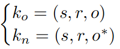

where ko is the old knowledge and kn is the new one. Generally, we witness an update from ko to kn through the variation of their generation probabilities.

**Vanilla Evaluation** Given this model $fθ$ after an isolated edit $e = (s, r, o → o∗)$. we get $fθ′$ (edited model).
 
 if $e' \in I(e)$: $fθ′$ -> $o*$; $I(e)$: related samples (excluding e). 
 
 else if $e' \in O(e)$: $fθ′$ -> $o$; $O(e)$: unrelated samples. 

- $I$ is built using neighbors of $e$. Meng et al. (2022) 

- $O$ is built from unrelated set $\{(s′, r, o); s′ \neq s\}$, which restricts the actuating scope of $e$. 

- **The Reliability** metric evaluates results on the fact $(s, r, o∗)$, 

- **the Generalization** and Locality metric evaluate results on $I$ and $O$ respectively. 

These metrics effectively constrain certain edits to an expected actuating scope (Meng et al., 2022; Wang et al., 2023b; Yao et al., 2023). 

In our experiments, for each edit $e$, we compute the results by averaging the performance of the label over the edit itself $e$ and the related samples $I(e)$.

**Editing Methods:** Fine-tuning (FT), MEND, ROME, MEMIT.

**Knowledge Conflict Analysis**

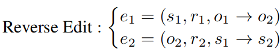
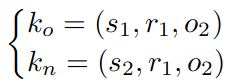

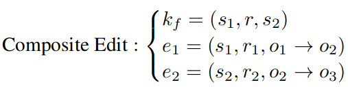
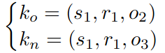

**Knowledge Distortion Analysis**

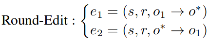

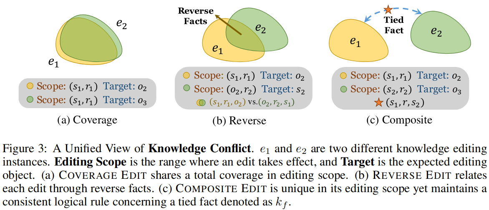

**Hard and Easy Edits:**
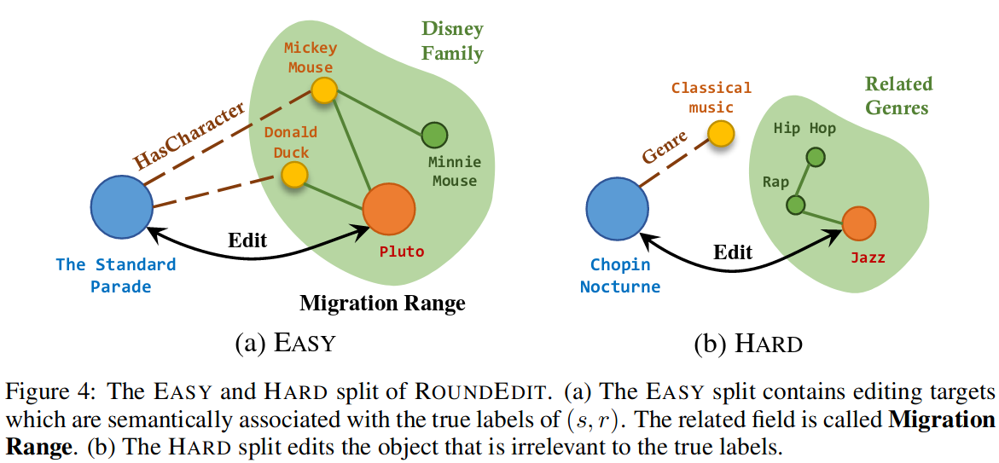

## 2. [FactCHD: Benchmarking Fact-Conflicting Hallucination Detection](http://arxiv.org/abs/2310.12086)

## 3. [Model Editing Can Hurt General Abilities of Large Language Models](http://arxiv.org/abs/2401.04700)

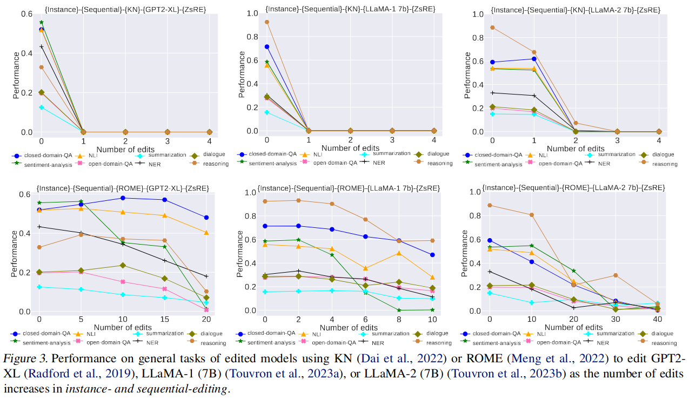

## 4. [Knowledge Editing on Black-box Large Language Models](http://arxiv.org/abs/2402.08631)

**Evaluation Protocol :**
- Previous studies (Meng et al., 2022a; Mitchell et al., 2022; Yao et al., 2023; Zheng et al., 2023) primarily assess knowledge editing (KE) based on three metrics: **Efficacy**, **Generalization**, and **Specifity**, by calculating the change in logits of the model before and after editing.
    1. The **inaccessibility of logits for black-box LLMs** such as ChatGPT poses challenges, rendering these metrics ineffective.
    2. KE should only modify spans in the response involving the edit, while keeping the response’s style unchanged to minimize negative impacts of editing. However, this aspect has been fully overlooked, leading to incomplete evaluation.

**Improved Multi-perspective Evaluation :**
For black-box LLMs editing, the evaluation of KE focuses on what changes and what remains in the edited output $y_e$ compared to original output $y_o$.

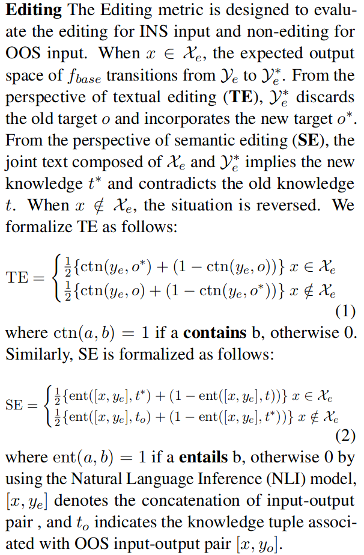

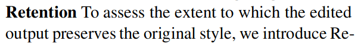
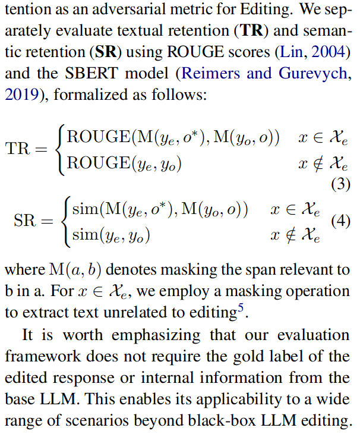

## 5. [Model Editing at Scale leads to Gradual and Catastrophic Forgetting](http://arxiv.org/abs/2401.07453)

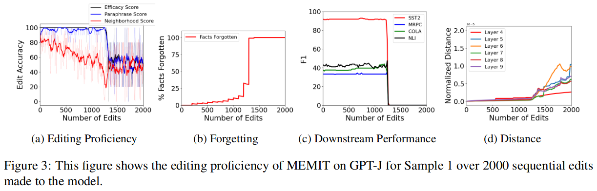

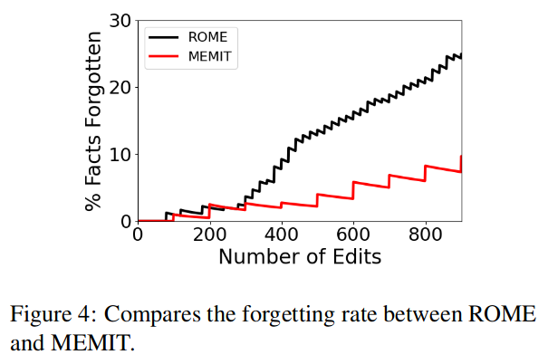

## 6. [Neighboring Perturbations of Knowledge Editing on Large Language Models](https://arxiv.org/abs/2401.17623)

Introduced two metrics AFF and ANF. (to be checked)