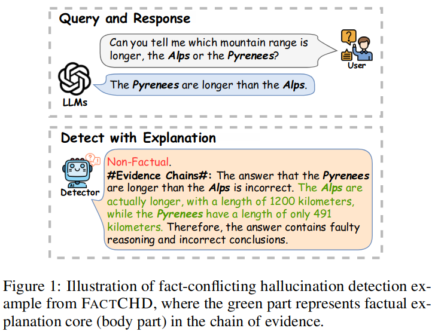
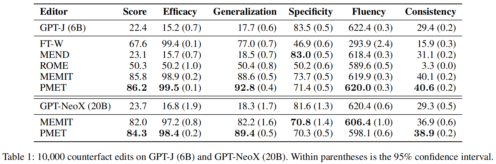
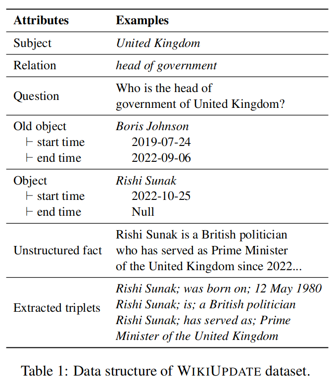
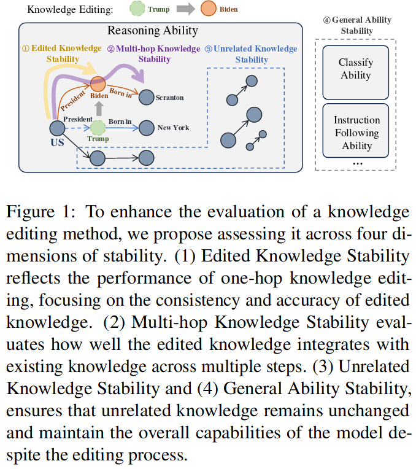

# Research Journal

## Subject: Evaluation protocol of knowledge updates in large language models (LLMs)

## Sujet: Protocole d'évaluation des mises à jour des connaissances des grands modèles de langue

### author : Abderrahmane Ait gueni ssaid

## Week 1 : 

### Day 1 :
Discussed with Hichem about the subject
started reading the first two papers.
Finished installation of Orange laptop.

### Day 2 :
Reading papers.
Discussed with Hichem about : 
WikiFactDiff, how knowledge is represented and how the updates are generated bitween two dates from wikidata.

Installed Conda and Docker

# Papers

## 1. [Unveiling the Pitfalls of Knowledge Editing for Large Language Models](http://arxiv.org/abs/2310.02129) [ICLR][To read]

- will knowledge editing trigger butterfly effect?

- new benchmark datasets : 
    1. ConflictEdit: Reverse edit, Composite edit
    2. RoundEdit
- two pivotal concerns:
    
    1. Knowledge Conflict: Editing groups of facts that logically clash can magnify the inherent inconsistencies in LLMs—a facet neglected by previous methods.
    
    2. Knowledge Distortion: Altering parameters with the aim of editing factual knowledge can irrevocably warp the innate knowledge structure of LLMs.

- **Experimental results** vividly demonstrate that knowledge editing might inadvertently cast a shadow of unintended consequences on LLMs, which warrant attention and efforts for future works.

- **Multi-label Edit (MLE)** that combines multiple correct labels of the edit to a single process, as depicted in Figure 2 (b) bottom, which is capable to alleviate knowledge distortion and restore similar behavior compared with the original model.

**Definition of Knowledge Editing for LLMs**

Suppose a factual knowledge as a triplet $(s, r, o)$, an edit $e = (s, r, o → o∗)$ modifies the object from o to o∗ for given subject s and relation r. After applying this edit to a language model $f_θ$ (where $θ$ denotes the model’s parameters), there is a knowledge update applied to the model, that is

where ko is the old knowledge and kn is the new one. Generally, we witness an update from ko to kn through the variation of their generation probabilities.

**Vanilla Evaluation** Given this model $fθ$ after an isolated edit $e = (s, r, o → o∗)$. we get $fθ′$ (edited model).
 
 if $e' \in I(e)$: $fθ′$ -> $o*$; $I(e)$: related samples (excluding e). 
 
 else if $e' \in O(e)$: $fθ′$ -> $o$; $O(e)$: unrelated samples. 

- $I$ is built using neighbors of $e$. Meng et al. (2022) 

- $O$ is built from unrelated set $\{(s′, r, o); s′ \neq s\}$, which restricts the actuating scope of $e$. 

- **The Reliability** metric evaluates results on the fact $(s, r, o∗)$, 

- **the Generalization** and Locality metric evaluate results on $I$ and $O$ respectively. 

These metrics effectively constrain certain edits to an expected actuating scope (Meng et al., 2022; Wang et al., 2023b; Yao et al., 2023). 

In our experiments, for each edit $e$, we compute the results by averaging the performance of the label over the edit itself $e$ and the related samples $I(e)$.

**Editing Methods:** Fine-tuning (FT), MEND, ROME, MEMIT.

**Knowledge Conflict Analysis**

**Knowledge Distortion Analysis**

**Hard and Easy Edits:**

## 2. [FactCHD: Benchmarking Fact-Conflicting Hallucination Detection](http://arxiv.org/abs/2310.12086)

## 3. [Model Editing Can Hurt General Abilities of Large Language Models](http://arxiv.org/abs/2401.04700) [just the figure 3]

## 4. [Knowledge Editing on Black-box Large Language Models](http://arxiv.org/abs/2402.08631)

**Evaluation Protocol :**
- Previous studies (Meng et al., 2022a; Mitchell et al., 2022; Yao et al., 2023; Zheng et al., 2023) primarily assess knowledge editing (KE) based on three metrics: **Efficacy**, **Generalization**, and **Specifity**, by calculating the change in logits of the model before and after editing.
    1. The **inaccessibility of logits for black-box LLMs** such as ChatGPT poses challenges, rendering these metrics ineffective.
    2. KE should only modify spans in the response involving the edit, while keeping the response’s style unchanged to minimize negative impacts of editing. However, this aspect has been fully overlooked, leading to incomplete evaluation.

**Improved Multi-perspective Evaluation :**
For black-box LLMs editing, the evaluation of KE focuses on what changes and what remains in the edited output $y_e$ compared to original output $y_o$.

## 5. [Model Editing at Scale leads to Gradual and Catastrophic Forgetting](http://arxiv.org/abs/2401.07453) [To read not in priority]

## 6. [Neighboring Perturbations of Knowledge Editing on Large Language Models](https://arxiv.org/abs/2401.17623)

Introduced two metrics AFF and ANF. (to be checked)

## 7. [Neuron Patching: Neuron-level Model Editing on Code Generation and LLMs](http://arxiv.org/abs/2312.05356)

## 8. [Retrieval-augmented Multilingual Knowledge Editing](http://arxiv.org/abs/2312.13040)

- What happens if the new knowledge is supplied in one language, but we would like to query the LLM in a different language?
- ReMaKE can perform model-agnostic knowledge editing in multilingual settings.
- ReMaKE concatenates the new knowledge retrieved from a multilingual knowledge base with prompts
- Our experimental results show that ReMaKE outperforms baseline knowledge editing methods by a significant margin and is the first KE method to work in a multilingual setting.
- We provide our multilingual knowledge editing dataset (MzsRE) in 12 languages, which along with code, and additional project information is available at https://github.com/Vicky-Wil/ReMaKE.

Edit on English, test on other languages

Edit on other languages, test on English

## 9. [Is it Possible to Edit Large Language Models Robustly?](https://arxiv.org/abs/2402.05827)Is it Possible to Edit Large Language Models Robustly?

**Metrics.** All metrics are computed based on generated text from the edited model. After editing, the prompts are inputted and the model outputs are collected. Then the output is normalized. The edit is counted as a success if the new answer o′ appears in the output, denoted as accuracy. We additionally compute the appearance of the original answer o, denoted as reversion.

**Analysis**
    
    1. Existing benchmarks edit less popular entities on the aspects of Frequency, Connection, and Co-occurrence. 

    2. Language models have weaker memory for less popular knowledge, thus simplifying the editing and resulting in biased findings.

    3. Editing more popular knowledge is more difficult and more vulnerable to rephrasing.

**Conclusion**

    1.  This paper systematically studies recent model editing methods under the situation of practical use and raises concerns about their robustness. 

    2. We show that confusion and hallucination occur in realistic dialogues with edited LLMs. Besides the user-AI interaction, 

    3. We rephrase the prompts by changing the format or adding context to attack editing. 

    4. The vulnerability of target knowledge is shown in our experiments. 
    5. For more analysis, three knowledge popularity measurements are proposed. 

    6. We show that more popular knowledge is memorized better, easier to recall, and harder to robustly edit for LLMs.

    7. Although editing methods show inspiring success in manipulating the memory and behaviors of LLMs, they can be problematic in practical situations.

## 10. [DeepEdit: Knowledge Editing as Decoding with Constraints](https://arxiv.org/abs/2401.10471)

**Designing Constraints for Knowledge Editing**

For every reasoning step:
1. **[Uniqueness]** should be different from the prior ones. 

2. **[Coherence]** should be relevant to the last reasoning step.

3. **[Awareness]** cannot contradict to any updated knowledge.

4. **[Relevance]** should be relevant and helpful to finding the answer.

## 11. [Navigating the Dual Facets: A Comprehensive Evaluation of Sequential Memory Editing in Large Language Models](http://arxiv.org/abs/2402.11122) [Anonymous ACL submission]

    - We pioneer a comprehensive evaluation of post-edited LLMs to assess their general capabilities in sequential memory editing scenarios. Our study uniquely covers both types of ME methods and examines their impacts across six core capabilities of LLMs, revealing distinct drawbacks.

    - Our comprehensive experiments suggest that instruction tuning, editing deeper layers, increasing model size, and increasing the batch size of memory editing are beneficial to mitigate the damage caused by the parametermodifying ME methods, but cannot entirely overcome the adverse effect.

    - We analyze the damage of ME to LLMs in three dimensions: (1) parameter changes, (2) language modeling capability, and (3) in-context learning capability, which partially explains how memory editing influences LLMs, providing insights for the development of new ME methods and mitigation strategies.

**Conclusions** 

We conduct a comprehensive evaluation of two types of memory editing methods for LLMs across eight diverse benchmarks. Our findings indicate that:
1. parameter-modifying ME methods tend to systematically degrade the model performance on general downstream tasks. 
2. In contrast, the parameterpreserving ME method, GRACE, successfully maintains the LLMs’ capabilities but fails to maintain generalization. 
3. We also show that increasing model size, instruction tuning, editing deeper layers, and increasing the batch size of memory editing are beneficial to mitigate the damage of parametermodifying ME methods to LLMs. 
4. Finally, we conduct an in-depth analysis of how parametermodifying ME methods hurt the general capabilities of LLMs. 
5. Overall, our research provides comprehensive insights into the dynamics of how, when, and why memory editing influences LLMs, offering valuable guidance for future research on memory editing.

**Limitations** 
1. Despite the contributions, our study still has limitations. Our experiments on parameter-preserving ME methods are not exhaustive. 
2. As shown in Figure 4, there is an observed performance decrease after 100 edits when editing layers 20/25 with ROME.
3. Further experiments are needed to understand these long-term effects. 
4. Besides, we do not completely explain why LLMs can maintain in-context learning capabilities after being sequentially edited. 
5. These limitations highlight areas for future research, underscoring the need for more extensive investigations to refine our understanding of the intricate balance between knowledge editing and model integrity in LLMs.

PMET
## 12. [PMET: Precise Model Editing in a Transformer](https://arxiv.org/abs/2308.08742) [Cited by 23] DO NOT READ

## 13. [Updating Language Models with Unstructured Facts: Towards Practical Knowledge Editing](https://arxiv.org/abs/2402.18909) 

**Main Results**

1. Unstructured knowledge editing poses more challenges.
2. In-context learning methods perform relatively better on UKE.
3. Extracted triplets have limited effects.
4. Real-world updates in WIKIUPDATE are more difficult for editing.

## Stable Knowledge Editing in Large Language Models

